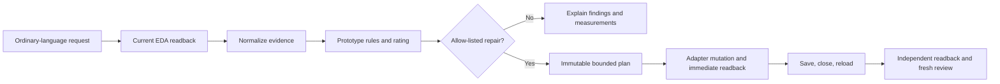

# codex-jlceda-hardware-agent

> **v0.1.0-alpha · NOT FOR MANUFACTURING**

**A prototype-readiness quality gate for AI-generated JLCEDA designs.**

This is not another tool that merely asks AI to draw a PCB. It helps non-experts decide whether an AI-generated design is worth prototyping and—only for proven allow-listed repairs—defines a bounded mutation and independent re-validation workflow.

[简体中文](README.zh-CN.md)

[Install](INSTALL.md) · [Demo](docs/demo.md) · [Evidence schema](docs/evidence-schema.md) · [Roadmap](docs/roadmap.md)

## Why this exists

An editable schematic, routed PCB, or `DRC=0` result proves only part of what matters. A design may still have the wrong footprint, insufficient regulator headroom, unacceptable thermal loss, undersized protection, narrow power paths, missing local energy storage, unsafe interface levels, poor current return paths, or a change that disappears after reload.

This alpha exposes an explainable, read-only Prototype review engine, reusable evidence schemas, a portable agent skill, and sanitized evaluation fixtures.

## What v0.1.0-alpha includes

- ordinary-language routing into **Draft**, **Prototype**, and **Manufacturing Release** work modes;
- normalized evidence for schematic/PCB identity, electrical, thermal, routing and persistence checks;
- deterministic Prototype review with three ratings;
- immutable-plan and allow-list principles for bounded repairs;
- save/close/reload and independent readback as mandatory persistence gates;
- a 5 V / 1 A distribution-board BEFORE/AFTER evaluation pair whose AFTER result remains an offline forecast pending live save/reload evidence;
- an adversarial two-motor controller fixture where EDA gates pass but engineering blockers remain.

## What it does not claim

- general autonomous schematic or PCB repair;
- general cross-document atomic rollback on non-empty designs;
- Manufacturing Release, certification, or physical functional proof;
- SI/PI/EMC sign-off, thermal-chamber evidence, motor stall characterization, assembly fit, procurement availability, upload, ordering, payment, or manufacture;
- ownership of JLCEDA/EasyEDA, any EDA API, EasyEDA Copilot, supplier catalogs, component data, or manufacturer data sheets.

Third-party draft generators and EDA bridges are adapters. Their source, binaries, extensions, private logs and project evidence are not included.

## Review model

Machine-stable ratings:

| Rating | Meaning |
| --- | --- |
| `not_suitable_for_prototype` | One or more high-confidence blockers remain. |
| `suitable_after_corrections` | Deterministic blockers may be closed, but important evidence or assumptions still require correction or confirmation. |
| `suitable_for_low_risk_prototype` | The configured Prototype gates pass; physical validation is still required. |

Representative rule families include identity/footprint, regulator headroom and thermal loss, current protection, H-bridge loss, PCB current capacity, decoupling, bulk storage, interface voltage margin, debug access, return paths, topology, containment, DRC and persistence.

## Workflow



## Quick start

Requirements: Python 3.10+; PowerShell is optional. The review engine uses only the Python standard library.

```powershell
python src/review/prototype_review.py `
  --input tests/review/fixtures/synthetic-safe-input.json `
  --profiles src/review/component-profiles.json `
  --output out/synthetic-safe
```

Run tests:

```powershell
python -m unittest discover -s tests/review -p "test_*.py" -v
```

Replay the published evaluations:

```powershell
python scripts/run-evals.py
```

The input is normalized engineering evidence, not a raw EDA project. A live adapter must be independently audited before it is used for mutation.

For local plugin setup and removal, see [INSTALL.md](INSTALL.md). The plugin ships no MCP server, workstation wrapper or third-party EDA extension; live EDA is an environment integration.

## Evaluation fixtures

- [`power-distribution-before`](evals/power-distribution-before/README.md): six-component synthetic fixture with one intended local-bypass blocker; offline evaluation.
- [`power-distribution-after`](evals/power-distribution-after/README.md): seven-component successor with a locked 100 nF X7R capacitor; offline forecast until a live save/reload run is recorded.
- [`car-controller-adversarial`](evals/car-controller-adversarial/README.md): sanitized 28-component fixture with containment and DRC=0, yet multiple electrical and layout risks. The `9/9` metric refers only to predefined manual benchmark risk families in this fixture.
- [`synthetic-safe`](evals/synthetic-safe/README.md): synthetic regression fixture expected to pass the configured review gates.

## Repository map

- `src/review/` — deterministic review engine and component profile facts;
- `schemas/` — reusable snapshot, intent, lockfile, hardware-contract and immutable-plan contracts;
- `skills/` — portable agent skill and policy references;
- `evals/` — sanitized, synthetic evaluation cases;
- `docs/` — architecture, review model, supported repairs and limitations;
- `release-audit/` — publication inventory and scan results.
- `examples/` — ordinary-Chinese requests and expected output boundaries.

## Security and privacy

See [SECURITY.md](SECURITY.md) and [Privacy](docs/privacy.md). The release excludes absolute workstation paths, usernames, internal UUIDs, approvals, checkpoints, private logs, screenshots, EDA extension packages and data-sheet PDFs. Component sources are linked, not bundled.

Release-review artifacts: [public files](PUBLIC-FILES.md), [excluded files](EXCLUDED-FILES.md), [privacy scan](PRIVACY-SCAN.md), [test report](TEST-REPORT.md), and [release checklist](RELEASE-CHECKLIST.md).

## Status

This alpha primarily publishes the review model, evidence structure, sanitized evaluations and bounded workflow. Automatic repair is described only at the status shown in [supported-repairs.md](docs/supported-repairs.md). See [Limitations](docs/limitations.md), [Roadmap](docs/roadmap.md), and fixture-scoped [resume wording](docs/resume.md) for claim boundaries.

## License and attribution

The proposed project license is Apache-2.0, subject to the ownership gate documented in [LICENSE-DECISION.md](LICENSE-DECISION.md). See [NOTICE](NOTICE) and [THIRD_PARTY.md](THIRD_PARTY.md).
