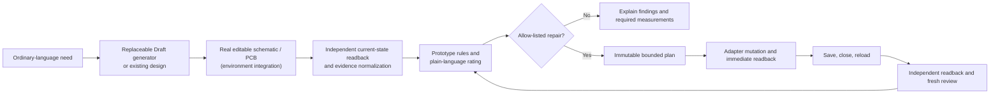

# codex-jlceda-hardware-agent

> **v0.1.1-alpha local candidate · NOT FOR MANUFACTURING**

**An independent prototype-readiness quality gate and bounded repair loop for editable JLCEDA designs.**

This is not another tool that merely asks AI to draw a PCB. Its intended end-to-end workflow is:

> **Ordinary-language need → real editable schematic/PCB → independent automated review → allow-listed correction → save/reload re-verification → plain-language prototype rating**

The Draft generator is a replaceable adapter, not the trusted core. The project's durable value is the independent evidence model, conservative review, bounded repair policy and persistence-aware re-validation loop. This alpha runs the review core offline; live Draft generation and EDA mutation remain separately audited environment integrations.

[简体中文](README.zh-CN.md)

[Install](INSTALL.md) · [Demo](docs/demo.md) · [Evidence schema](docs/evidence-schema.md) · [M2 evidence gate](docs/m2-evidence-gate.md) · [Reproducible release](docs/reproducible-release.md) · [Roadmap](docs/roadmap.md)

## Why this exists

An editable schematic, routed PCB, or `DRC=0` result proves only part of what matters. A design may still have the wrong footprint, insufficient regulator headroom, unacceptable thermal loss, undersized protection, narrow power paths, missing local energy storage, unsafe interface levels, poor current return paths, or a change that disappears after reload.

This alpha exposes an explainable, read-only Prototype review engine, reusable evidence schemas, a portable agent skill, and sanitized evaluation fixtures. It does not trust a Draft generator's success response as proof that an editable design is correct or persisted.

### A worked example: DRC=0 is not prototype-ready

A 28-component 2WD robot controller board generated by a commercial AI assistant
(EasyEDA Copilot 1.1.5) passed every conventional gate:

| Conventional gate | Result |
| --- | --- |
| Generator's own PCB DRC | 0 findings |
| Independent PCB DRC | 0 findings |
| Schematic ERC errors | 0 |
| Connectivity | pass |
| Board-outline containment | pass |
| Copper pours / GND stitching vias | 2 / 50 |
| Saved and reloaded | yes |

An engineer looking only at those numbers would conclude the board is ready to
order. This project's independent review rated it **not suitable for prototype**
and reported five blocking engineering defects, each with the measurement or
calculation behind it:

1. **R1** — U3 identity/package mismatch and insufficient 6 V headroom
2. **R2** — F1 protection fuse undersized
3. **R3** — L293D thermal dissipation and voltage drop
4. **R4** — power trace widths below the current requirement
5. **R5** — missing L293D local decoupling and bulk energy storage

Plus eight advisories, including ultrasonic echo margin, HC-05 pinout identity,
SWD NRST handling, regulator capacitor stability and motor return path.

DRC checks geometry and connectivity rules. It does not check whether the design
is *electrically and thermally sound*. That gap — undersized protection, missing
local energy storage, inadequate power paths, wrong part identity — is what this
review engine exists to close. The review was read-only: no mutation, no
manufacturing output.

Evidence: `prototype-review-machine-evidence.json` conforming to
[`jlceda-prototype-review-evidence/1.0`](docs/evidence-schema.md). The nine
risk families exercised by this fixture are enumerated in
[docs/demo.md](docs/demo.md); see
[What it does not claim](#what-it-does-not-claim) for the limits of this result.

## What v0.1.1-alpha includes

- ordinary-language routing into **Draft**, **Prototype**, and **Manufacturing Release** work modes;
- adapter-neutral handoff from a replaceable Draft generator or an existing editable design into independent current-state review;
- normalized evidence for schematic/PCB identity, electrical, thermal, routing and persistence checks;
- deterministic Prototype review with three ratings;
- immutable-plan and allow-list principles for bounded repairs;
- save/close/reload and independent readback as mandatory persistence gates;
- a 5 V / 1 A distribution-board BEFORE/AFTER evaluation pair whose synthetic fixtures remain offline replays, plus a separately gated minimal public summary of the verified live save/reload loop;
- an independent M3 sensor-adapter repetition: a real five-component BEFORE state produced one local-bypass blocker, one allow-listed `ADD_LOCAL_BYPASS_CAP` plan added a locked 100 nF X7R C0805, and the saved/reloaded six-component AFTER state passed ERC, connectivity, containment, strict DRC and fresh review;
- an adversarial two-motor controller fixture where EDA gates pass but engineering blockers remain.

## What it does not claim

- general autonomous schematic or PCB repair;
- general cross-document atomic rollback on non-empty designs;
- Manufacturing Release, certification, or physical functional proof;
- SI/PI/EMC sign-off, thermal-chamber evidence, motor stall characterization, assembly fit, procurement availability, upload, ordering, payment, or manufacture;
- ownership of JLCEDA/EasyEDA, any EDA API, EasyEDA Copilot, supplier catalogs, component data, or manufacturer data sheets.

Third-party Draft generators and EDA bridges are replaceable adapters. Their source, binaries, extensions, private logs and project evidence are not included, and their acknowledgements are not treated as independent review evidence.

## Review model

Machine-stable ratings:

| Rating | Meaning |
| --- | --- |
| `not_suitable_for_prototype` | One or more high-confidence blockers remain. |
| `suitable_after_corrections` | Deterministic blockers may be closed, but important evidence or assumptions still require correction or confirmation. |
| `suitable_for_low_risk_prototype` | All six current-state gates are explicitly present, correctly typed and passed, with no offline-scope or contradictory evidence; physical validation is still required. |

Representative rule families include identity/footprint, regulator headroom and thermal loss, current protection, H-bridge loss, PCB current capacity, decoupling, bulk storage, interface voltage margin, debug access, return paths, topology, containment, DRC and persistence.

The strict `rating` fails closed unless `schematicErrors`, `schematicWarnings`, `pcbDrcFindings`, `unroutedNets`, `containment` and `savedReloaded` are all explicit and valid. Missing or contradictory evidence produces stable `EVIDENCE_INCOMPLETE:*` or `EVIDENCE_CONFLICT:*` findings. `engineeringForecastRating` is reported separately for offline engineering prediction and is never a current live-prototype release rating.

## Workflow



The diagram describes the governed product loop. The portable alpha repository independently demonstrates the normalization, review, rating and policy layers; it does not bundle the live Draft or mutation adapters.

## Quick start

Requirements: Python 3.10+; PowerShell is optional. The review engine uses only the Python standard library.

```powershell
python src/review/prototype_review.py `
  --input tests/review/fixtures/synthetic-safe-input.json `
  --profiles src/review/component-profiles.json `
  --output out/synthetic-safe
```

Audit the locked component-profile provenance and freshness entirely offline. The
explicit date makes the result reproducible; this gate does not change the public
three-level Prototype rating:

```powershell
python src/review/component_profile_audit.py `
  --profiles src/review/component-profiles.json `
  --as-of 2026-07-28
```

Run tests:

```powershell
python -m unittest discover -s tests/review -p "test_*.py" -v
```

Replay the published evaluations:

```powershell
python scripts/run-evals.py
```

Validate an explicitly supplied sanitized M2 live-evidence bundle without contacting EDA:

```powershell
python scripts/import_m2_evidence.py `
  --input-dir <sanitized-input> `
  --sha-manifest <sanitized-input>/SHA256-MANIFEST.json `
  --output-dir <commit-ready-public-output>
```

The gate keeps incomplete M2 evidence pending, rejects hash/privacy failures and
writes only one minimal idempotent summary after the complete BEFORE/AFTER loop
passes. The current public summary passed that gate; the bundled positive unit
fixture remains synthetic branch coverage and carries no live claim.

The input is normalized engineering evidence, not a raw EDA project. A live adapter must be independently audited before it is used for mutation.

Build the only public allow-listed repair plan (offline and without private IDs):

```powershell
python scripts/plan-local-bypass.py `
  --review out/before/machine-review.json `
  --evidence normalized-before.json `
  --goal "Add a 100 nF local bypass near the output and re-verify" `
  --output out/local-bypass-repair-plan.json
```

The planner accepts only one high-confidence `DECOUPLING_DISTANCE:*` blocker
with complete passing current-state gates, unambiguous target networks and no
already-qualified bypass. It locks the verified capacitor and revalidation
gates while leaving private target binding to an audited environment adapter.

For local plugin setup and removal, see [INSTALL.md](INSTALL.md). The plugin ships no MCP server, workstation wrapper or third-party EDA extension; live EDA is an environment integration.

## Evaluation fixtures

- [`power-distribution-before`](evals/power-distribution-before/README.md): six-component synthetic fixture with one intended local-bypass blocker; offline evaluation.
- [`power-distribution-after`](evals/power-distribution-after/README.md): seven-component offline successor replay with a locked 100 nF X7R capacitor; a separate gate-verified public summary records the live save/reload closure.
- [`car-controller-adversarial`](evals/car-controller-adversarial/README.md): sanitized 28-component fixture with containment and DRC=0, yet multiple electrical and layout risks. The `9/9` metric refers only to predefined manual benchmark risk families in this fixture.
- [`synthetic-safe`](evals/synthetic-safe/README.md): offline synthetic regression whose engineering forecast passes while strict readiness stays fail-closed on contradictory live/persistence metadata.
- [`evidence/m3-independent-repetition`](evidence/m3-independent-repetition/README.md): gate-generated minimum public evidence for the independent M3 BEFORE→repair→AFTER repetition. The legacy `m2-live-evidence-summary.json` filename is retained for v0.1.0 gate compatibility; its case field identifies M3.

## Repository map

- `src/review/` — deterministic review engine and component profile facts;
- `schemas/` — reusable snapshot, intent, lockfile, hardware-contract and immutable-plan contracts;
- `skills/` — portable agent skill and policy references;
- `evals/` — sanitized, synthetic evaluation cases;
- `docs/` — architecture, review model, supported repairs and limitations;
- `release-audit/` — publication inventory and scan results.
- `examples/` — ordinary-Chinese requests and expected output boundaries.
- `scripts/import_m2_evidence.py` — offline, explicit and privacy-rejecting M2 evidence gate.
- `scripts/plan-local-bypass.py` — deterministic `ADD_LOCAL_BYPASS_CAP` plan gate.
- `scripts/release-verify.py`, `update-integrity.py`, `build-release.py` — reproducible local verification and packaging.

## Security and privacy

See [SECURITY.md](SECURITY.md) and [Privacy](docs/privacy.md). The release excludes absolute workstation paths, usernames, internal UUIDs, approvals, checkpoints, private logs, screenshots, EDA extension packages and data-sheet PDFs. Component sources are linked, not bundled.

Release-review artifacts: [public files](PUBLIC-FILES.md), [excluded files](EXCLUDED-FILES.md), [privacy scan](PRIVACY-SCAN.md), [test report](TEST-REPORT.md), and [release checklist](RELEASE-CHECKLIST.md).

## Status

This alpha primarily publishes the review model, evidence structure, sanitized evaluations and bounded workflow. Automatic repair is described only at the status shown in [supported-repairs.md](docs/supported-repairs.md). The M2 live BEFORE/AFTER loop is represented only by the gate-generated minimal public summary: baseline blocker present, one bounded repair delivered, save/reload and independent readback verified, target finding resolved, DRC clean and fresh Prototype rating `suitable_for_low_risk_prototype`. The eval input files remain synthetic offline replays, and no physical-board or Manufacturing Release claim is made. See [Limitations](docs/limitations.md), [Roadmap](docs/roadmap.md), and fixture-scoped [resume wording](docs/resume.md) for claim boundaries.

## License and attribution

The proposed project license is Apache-2.0, subject to the ownership gate documented in [LICENSE-DECISION.md](LICENSE-DECISION.md). See [NOTICE](NOTICE) and [THIRD_PARTY.md](THIRD_PARTY.md).
