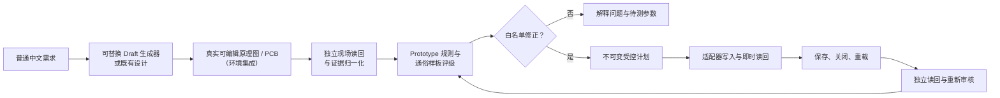

# codex-jlceda-hardware-agent

> **v0.1.1-alpha 本地候选 · NOT FOR MANUFACTURING（不可直接制造）**

**面向真实可编辑嘉立创EDA设计的独立 Prototype 打样前质量门与受控修正闭环。**

这不是又一个让 AI 画 PCB 的工具。它面向的完整用户流程是：

> **普通中文需求 → 真实可编辑原理图/PCB → 独立自动审核 → 白名单修正 → 保存重载复验 → 通俗样板评级**

Draft 生成器是可替换的适配器，不是可信核心。项目的核心价值是独立证据模型、保守审核、受控修正策略和关注持久化的复验闭环。本 alpha 可离线运行审核核心；真实 Draft 生成和 EDA 写入仍属于需要单独审计的环境集成。

[English](README.md)

[安装](INSTALL.md) · [演示](docs/demo.md) · [证据结构](docs/evidence-schema.md) · [M2证据导入门](docs/m2-evidence-gate.md) · [编排入口](docs/pipeline.md) · [只读适配器健康门](schemas/readonly-adapter-health.schema.json) · [可重复发布](docs/reproducible-release.md) · [路线图](docs/roadmap.md)

## 为什么需要它

原理图可编辑、PCB 已布线或 `DRC=0`，只证明了一部分几何和规则检查。设计仍可能存在封装错误、稳压余量不足、热损耗过高、保护器件过小、功率线过窄、局部储能缺失、接口电平风险、回流路径不合理，或者修改在重载后消失。

本 alpha 公开可解释的只读 Prototype 审核引擎、证据 Schema、可移植 Agent Skill 和脱敏评估样例。Draft 生成器返回“成功”不等于设计真实可编辑、正确或已持久保存，也不作为独立审核结论。

### 实例:DRC=0 不等于可以打样

某商业 AI 助手(EasyEDA Copilot 1.1.5)生成的 28 器件 2WD 小车主控板,通过了全部常规检查:

| 常规检查项 | 结果 |
| --- | --- |
| 生成器自带 PCB DRC | 0 问题 |
| 独立复核 PCB DRC | 0 问题 |
| 原理图 ERC 错误 | 0 |
| 连通性 | 通过 |
| 板框包含性 | 通过 |
| 铺铜 / 地缝合过孔 | 2 / 50 |
| 保存并重载 | 是 |

只看这些数字,工程师会认为这块板可以直接下单。本项目的独立审核判定其
**当前不适合样板**,并给出 5 个阻塞级工程缺陷,每一条都附带实测或计算依据:

1. **R1** — U3 型号/封装身份不符,且 6 V 余量不足
2. **R2** — F1 保护保险丝选型过小
3. **R3** — L293D 热耗散与压降
4. **R4** — 电源走线宽度低于电流需求
5. **R5** — 缺少 L293D 本地去耦与储能电容

另有 8 项提醒级问题,包括超声波回波余量、HC-05 引脚定义身份、SWD NRST 处理、
稳压器电容稳定性与电机回流路径。

DRC 校验的是几何与连接规则,**它不校验设计在电气和热学上是否成立**。保护选型过小、
本地储能缺失、电源路径不足、器件身份错误——这类缺口正是本审核引擎要补上的。
该次审核为只读:无任何改动,无制造输出。

证据文件:`prototype-review-machine-evidence.json`,符合
[`jlceda-prototype-review-evidence/1.0`](docs/evidence-schema.md)。该 fixture 覆盖的
九个风险族列举于 [docs/demo.md](docs/demo.md);结论边界见文末 **Alpha 边界**。

## v0.1.1-alpha 包含

- 普通语言请求到 **Draft / Prototype / Manufacturing Release** 工作模式的治理规则；
- 从可替换 Draft 生成器或既有可编辑设计进入独立现场读回的适配器中立交接；
- 原理图/PCB 身份、电气、热、布线与持久化证据的归一化结构；
- 三档确定性 Prototype 评级；
- 不可变修正计划与白名单动作原则；
- 保存、关闭、重载和独立读回门；
- 5V/1A 电源分配板 BEFORE/AFTER 评估对；合成 fixture 仍用于离线重放，并另附通过隐私门的真实保存重载最小公开摘要；
- 一个“EDA 门通过但仍不值得打样”的双电机控制器 adversarial fixture。


- 独立 M3 传感器转接板重复验证：真实 5 器件 BEFORE 仅命中本地旁路 blocker；白名单 `ADD_LOCAL_BYPASS_CAP` 加入锁定的 100nF X7R C0805；保存重载后的 6 器件 AFTER 通过 ERC、连通性、板框包含、严格 DRC 和全新复审。

## 不宣称

- 通用自主原理图或 PCB 修复；
- 在非空设计上的通用跨文档原子回滚；
- Manufacturing Release、认证或实物功能证明；
- SI/PI/EMC 签核、热箱证据、电机堵转定型、装配适配、采购可得性、上传、下单、支付或制造；
- 对嘉立创EDA/EasyEDA、EDA API、EasyEDA Copilot、供应商目录、器件数据或厂商数据手册的所有权。

第三方 Draft 生成器和 EDA Bridge 仅作为可替换适配器。其源码、二进制、扩展包、私有日志和项目证据不在本候选中，其操作 ACK 也不等同于独立审核证据。

## 工作流



上图描述受治理的产品闭环。本可移植 alpha 仓库独立演示证据归一化、审核、评级和策略层，不捆绑 live Draft 或写入适配器。

## 评级

| 机器字段 | 用户含义 |
| --- | --- |
| `not_suitable_for_prototype` | 仍有高置信度 blocker，当前不适合样板。 |
| `suitable_after_corrections` | 确定性问题可修正，但仍需补证或确认关键假设。 |
| `suitable_for_low_risk_prototype` | 六项当前状态门禁均明确存在、类型正确且通过，并且没有离线范围或证据矛盾；仍须实物验证。 |

审核族包括器件身份/封装、稳压余量与热、电流保护、H 桥损耗、PCB 载流、去耦、储能、接口电平、调试、回流、拓扑、板框、DRC 和保存重载。

严格 `rating` 要求 `schematicErrors`、`schematicWarnings`、`pcbDrcFindings`、`unroutedNets`、`containment`、`savedReloaded` 六项证据显式且有效。缺失或矛盾会产生稳定的 `EVIDENCE_INCOMPLETE:*` / `EVIDENCE_CONFLICT:*` finding。离线工程预测单独写入 `engineeringForecastRating`，不代表当前真实设计已经具备样板就绪证据。

## 快速开始

需要 Python 3.10+；PowerShell 可选。审核引擎只使用 Python 标准库。

```powershell
python src/review/prototype_review.py `
  --input tests/review/fixtures/synthetic-safe-input.json `
  --profiles src/review/component-profiles.json `
  --output out/synthetic-safe
```

完全离线审核锁定的器件档案来源与新鲜度。显式日期保证结果可复现；该门禁不会改变公开三档 Prototype 评级：

```powershell
python src/review/component_profile_audit.py `
  --profiles src/review/component-profiles.json `
  --as-of 2026-07-28
```

运行测试：

```powershell
python -m unittest discover -s tests/review -p "test_*.py" -v
```

重放公开评估：

```powershell
python scripts/run-evals.py
```

对明确指定的完整脱敏 M2 live 证据，可在离线状态运行：

```powershell
python scripts/import_m2_evidence.py `
  --input-dir <sanitized-input> `
  --sha-manifest <sanitized-input>/SHA256-MANIFEST.json `
  --output-dir <commit-ready-public-output>
```

生成当前唯一公开白名单修正计划（离线运行，不需要项目 UUID）：

```powershell
python scripts/plan-local-bypass.py `
  --review out/before/machine-review.json `
  --evidence normalized-before.json `
  --goal "在输出接口附近加入100nF本地旁路电容并重新复验" `
  --output out/local-bypass-repair-plan.json
```

计划器只接受唯一、高置信度的 `DECOUPLING_DISTANCE:*` blocker；六项当前状态门必须明确通过，目标网络必须唯一，且现场不得已有合格旁路。输出锁定器件与复验门，私有 target 绑定留给独立审计的现场适配层。

缺证据时门状态保持 `pending`，哈希或隐私问题进入 `rejected`；完整
BEFORE/AFTER 闭环通过后只产生一个最小、幂等的公开摘要。当前公开摘要
已通过该门；仓库内的正向单元测试 fixture 仍只是纯合成分支覆盖。

输入是归一化工程证据，不是原始 EDA 项目。任何 live mutation 适配器都需要独立安全审计。

只读适配器证据包的离线组装入口是 `scripts/build-readonly-adapter-envelope.py`：它只接受外部适配器已独立采集的脱敏 capture 和明确的 normalized design，重新计算规范化设计哈希，并拒绝 partial state；它不连接 EDA，也不把 ACK 或合成输入提升为现场证据。完整命令与失败/未知示例见 [Pipeline entry](docs/pipeline.md)。

针对 Gateway/Bridge 的 502、超时、无窗口或目标歧义，新增 `scripts/validate-readonly-adapter-health.py` 健康门：只有外部探针证明 HTTP 200、JSON 协议有效、单一目标、只读且零写入，才允许进入后续证据采集；健康门本身不授予 EDA 写入权。

本地插件安装和卸载见 [INSTALL.md](INSTALL.md)。插件不内置 MCP、工作站 wrapper 或第三方 EDA 扩展；live EDA 属于环境集成能力。

## 评估案例

- [`power-distribution-before`](evals/power-distribution-before/README.md)：6 器件合成fixture，唯一目标 blocker 是输出分支缺少合格本地旁路；离线评估。
- [`power-distribution-after`](evals/power-distribution-after/README.md)：7 器件离线 successor 重放，锁定新增 100nF X7R 电容；另有独立、门验证的公开摘要记录真实保存重载闭环。
- [`car-controller-adversarial`](evals/car-controller-adversarial/README.md)：脱敏的 28 器件fixture，板框包含和 DRC=0，但仍有多类电气/布局风险。`9/9` 只表示本fixture中预定义人工基准风险族的命中情况。
- [`synthetic-safe`](evals/synthetic-safe/README.md)：离线合成回归fixture；工程预测通过，但实时/持久化元数据矛盾时严格样板评级保持关闭失败。
- `power-input-before/after`：输入压差、保护器件电流预算和保守走线载流的原创合成 BEFORE/AFTER 基准。
- `sensor-interface-before/after`：接口电平裕量、本地去耦和回流路径声明的原创合成 BEFORE/AFTER 基准。
- `communication-interface-before/after`：调试恢复、样板可用性、原理图拓扑和固件管脚一致性的原创合成 BEFORE/AFTER 基准。

- [`evidence/m3-independent-repetition`](evidence/m3-independent-repetition/README.md)：独立 M3 BEFORE→修正→AFTER 的门控最小公开证据；为兼容 v0.1.0 证据门保留旧输出文件名，case 字段明确标识 M3。

## Alpha 边界

v0.1.0-alpha 主要公开审核模型、证据结构、脱敏评估样例和受控工作流。自动修复能力仅按已验证范围陈述；任何评级都不替代实物上电、测量和环境测试。M2 真实 BEFORE/AFTER 闭环仅通过门生成的最小公开摘要陈述：基线 blocker 存在、一次受控修正已交付、保存重载和独立读回通过、目标 finding 已关闭、DRC 为零且新鲜 Prototype 评级为 `suitable_for_low_risk_prototype`。评估输入文件仍是合成离线重放，不构成实物或 Manufacturing Release 声明。

更多信息见：

- [架构](docs/architecture.md)
- [审核模型](docs/review-model.md)
- [支持的修正](docs/supported-repairs.md)
- [限制](docs/limitations.md)
- [演示说明](docs/demo.md)
- [证据结构](docs/evidence-schema.md)
- [隐私与脱敏](docs/privacy.md)
- [路线图](docs/roadmap.md)
- [M2现场证据导入门](docs/m2-evidence-gate.md)
- [可重复本地发布](docs/reproducible-release.md)
- [只读适配器证据包契约](schemas/readonly-adapter-envelope.schema.json)
- [简历表述边界](docs/resume.md)
- [安全策略](SECURITY.md)
- [可公开文件](PUBLIC-FILES.md)
- [禁止公开文件](EXCLUDED-FILES.md)
- [隐私扫描](PRIVACY-SCAN.md)
- [测试报告](TEST-REPORT.md)
- [发布检查表](RELEASE-CHECKLIST.md)

建议采用 Apache-2.0，最终发布前仍需通过 [LICENSE-DECISION.md](LICENSE-DECISION.md) 的权属门。第三方归属见 [THIRD_PARTY.md](THIRD_PARTY.md)。
