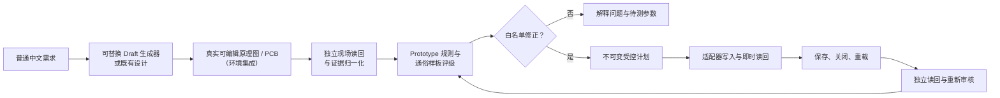

# codex-jlceda-hardware-agent

> **v0.1.0-alpha · NOT FOR MANUFACTURING（不可直接制造）**

**面向真实可编辑嘉立创EDA设计的独立 Prototype 打样前质量门与受控修正闭环。**

这不是又一个让 AI 画 PCB 的工具。它面向的完整用户流程是：

> **普通中文需求 → 真实可编辑原理图/PCB → 独立自动审核 → 白名单修正 → 保存重载复验 → 通俗样板评级**

Draft 生成器是可替换的适配器，不是可信核心。项目的核心价值是独立证据模型、保守审核、受控修正策略和关注持久化的复验闭环。本 alpha 可离线运行审核核心；真实 Draft 生成和 EDA 写入仍属于需要单独审计的环境集成。

[English](README.md)

[安装](INSTALL.md) · [演示](docs/demo.md) · [证据结构](docs/evidence-schema.md) · [M2证据导入门](docs/m2-evidence-gate.md) · [可重复发布](docs/reproducible-release.md) · [路线图](docs/roadmap.md)

## 为什么需要它

原理图可编辑、PCB 已布线或 `DRC=0`，只证明了一部分几何和规则检查。设计仍可能存在封装错误、稳压余量不足、热损耗过高、保护器件过小、功率线过窄、局部储能缺失、接口电平风险、回流路径不合理，或者修改在重载后消失。

本 alpha 公开可解释的只读 Prototype 审核引擎、证据 Schema、可移植 Agent Skill 和脱敏评估样例。Draft 生成器返回“成功”不等于设计真实可编辑、正确或已持久保存，也不作为独立审核结论。

## v0.1.0-alpha 包含

- 普通语言请求到 **Draft / Prototype / Manufacturing Release** 工作模式的治理规则；
- 从可替换 Draft 生成器或既有可编辑设计进入独立现场读回的适配器中立交接；
- 原理图/PCB 身份、电气、热、布线与持久化证据的归一化结构；
- 三档确定性 Prototype 评级；
- 不可变修正计划与白名单动作原则；
- 保存、关闭、重载和独立读回门；
- 5V/1A 电源分配板 BEFORE/AFTER 评估对；AFTER 在真实保存重载前仍标记为离线预测；
- 一个“EDA 门通过但仍不值得打样”的双电机控制器 adversarial fixture。

## 不宣称

- 通用自主原理图或 PCB 修复；
- 在非空设计上的通用跨文档原子回滚；
- Manufacturing Release、认证或实物功能证明；
- SI/PI/EMC 签核、热箱证据、电机堵转定型、装配适配、采购可得性、上传、下单、支付或制造；
- 对嘉立创EDA/EasyEDA、EDA API、EasyEDA Copilot、供应商目录、器件数据或厂商数据手册的所有权。

第三方 Draft 生成器和 EDA Bridge 仅作为可替换适配器。其源码、二进制、扩展包、私有日志和项目证据不在本候选中，其操作 ACK 也不等同于独立审核证据。

## 工作流



上图描述受治理的产品闭环。本可移植 alpha 仓库独立演示证据归一化、审核、评级和策略层，不捆绑 live Draft 或写入适配器。

## 评级

| 机器字段 | 用户含义 |
| --- | --- |
| `not_suitable_for_prototype` | 仍有高置信度 blocker，当前不适合样板。 |
| `suitable_after_corrections` | 确定性问题可修正，但仍需补证或确认关键假设。 |
| `suitable_for_low_risk_prototype` | 已通过配置的 Prototype 门；仍须实物验证。 |

审核族包括器件身份/封装、稳压余量与热、电流保护、H 桥损耗、PCB 载流、去耦、储能、接口电平、调试、回流、拓扑、板框、DRC 和保存重载。

## 快速开始

需要 Python 3.10+；PowerShell 可选。审核引擎只使用 Python 标准库。

```powershell
python src/review/prototype_review.py `
  --input tests/review/fixtures/synthetic-safe-input.json `
  --profiles src/review/component-profiles.json `
  --output out/synthetic-safe
```

运行测试：

```powershell
python -m unittest discover -s tests/review -p "test_*.py" -v
```

重放公开评估：

```powershell
python scripts/run-evals.py
```

未来取得完整脱敏 M2 live 证据后，可在离线状态运行：

```powershell
python scripts/import_m2_evidence.py `
  --input-dir <sanitized-input> `
  --sha-manifest <sanitized-input>/SHA256-MANIFEST.json `
  --output-dir <commit-ready-public-output>
```

缺证据时门状态保持 `pending`，哈希或隐私问题进入 `rejected`；完整
BEFORE/AFTER 闭环通过后只产生一个最小、幂等的公开摘要。仓库内的正向
门测试 fixture 为纯合成数据，不代表 M2 已取得 live 证据。

输入是归一化工程证据，不是原始 EDA 项目。任何 live mutation 适配器都需要独立安全审计。

本地插件安装和卸载见 [INSTALL.md](INSTALL.md)。插件不内置 MCP、工作站 wrapper 或第三方 EDA 扩展；live EDA 属于环境集成能力。

## 评估案例

- [`power-distribution-before`](evals/power-distribution-before/README.md)：6 器件合成fixture，唯一目标 blocker 是输出分支缺少合格本地旁路；离线评估。
- [`power-distribution-after`](evals/power-distribution-after/README.md)：7 器件 successor，锁定新增 100nF X7R 电容；在记录真实保存重载前只称为离线预测。
- [`car-controller-adversarial`](evals/car-controller-adversarial/README.md)：脱敏的 28 器件fixture，板框包含和 DRC=0，但仍有多类电气/布局风险。`9/9` 只表示本fixture中预定义人工基准风险族的命中情况。
- [`synthetic-safe`](evals/synthetic-safe/README.md)：预期通过当前审核门的合成回归fixture。

## Alpha 边界

v0.1.0-alpha 主要公开审核模型、证据结构、脱敏评估样例和受控工作流。自动修复能力仅按已验证范围陈述；任何评级都不替代实物上电、测量和环境测试。M2 BEFORE/AFTER 当前仍等待真实 EDA 与保存重载证据；AFTER 的通过结果只是离线预测，不是已完成的 live 修正声明。

更多信息见：

- [架构](docs/architecture.md)
- [审核模型](docs/review-model.md)
- [支持的修正](docs/supported-repairs.md)
- [限制](docs/limitations.md)
- [演示说明](docs/demo.md)
- [证据结构](docs/evidence-schema.md)
- [隐私与脱敏](docs/privacy.md)
- [路线图](docs/roadmap.md)
- [M2现场证据导入门](docs/m2-evidence-gate.md)
- [可重复本地发布](docs/reproducible-release.md)
- [简历表述边界](docs/resume.md)
- [安全策略](SECURITY.md)
- [可公开文件](PUBLIC-FILES.md)
- [禁止公开文件](EXCLUDED-FILES.md)
- [隐私扫描](PRIVACY-SCAN.md)
- [测试报告](TEST-REPORT.md)
- [发布检查表](RELEASE-CHECKLIST.md)

建议采用 Apache-2.0，最终发布前仍需通过 [LICENSE-DECISION.md](LICENSE-DECISION.md) 的权属门。第三方归属见 [THIRD_PARTY.md](THIRD_PARTY.md)。
