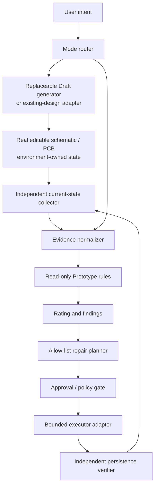

# Architecture

## Goals

- Support the governed product loop: ordinary-language need → real editable schematic/PCB → independent automated review → allow-listed correction → save/reload re-verification → plain-language prototype rating.
- Keep Draft generation replaceable and outside the independent trust core.
- Judge whether current EDA evidence supports a low-risk prototype.
- Keep findings explainable, reproducible and linked to engineering evidence.
- Permit only bounded, allow-listed repairs with persistence and regression gates.

## Non-goals

- Replacing the EDA application, autorouter or component catalog.
- Treating a mutation acknowledgement as evidence of a saved design.
- General autonomous board repair or manufacturing release.
- Bundling third-party generators, EDA extensions or data-sheet PDFs.

## Trust boundaries

The public repository includes the router policy, normalized evidence contracts, review engine and evaluation fixtures. A live EDA adapter is an integration boundary and must be audited separately.

The Draft generator can be swapped without changing the evidence contracts or review rules. Its success acknowledgement is never an input of equal trust to independent current-state readback. The core value begins at that trust boundary: normalize what actually exists, review it conservatively, constrain any repair, and require persistence plus regression evidence before updating the user-facing rating.

## Deployment profiles

| Profile | Included in alpha | EDA access | Claim |
| --- | --- | --- | --- |
| Offline review | Yes | None | Run deterministic review and fixture replay from normalized JSON. |
| Agent skill | Yes | None by default | Route intent, explain evidence/rating, and enforce published boundaries. |
| Draft generation / design import | Replaceable environment integration | Adapter-specific | Produce or open a real editable design; its output must still be collected and reviewed independently. |
| Live read-only collection | Environment integration | Adapter-specific | Produce current normalized evidence after independent adapter audit. |
| Live bounded mutation | Experimental environment integration | Adapter-specific write access | Only for an allow-listed repair with exact baseline, compensation and persistence gates. |

The plugin manifest intentionally declares no MCP server or app. This prevents a portable review release from silently depending on a workstation wrapper, port, service or third-party extension.

The M2 BEFORE/AFTER fixtures currently exercise the offline review boundary only. Their AFTER rating remains a forecast until complete live EDA and save/reload evidence passes the publication gate; the architecture does not infer live verification from fixture replay.

## Components

1. **Task router** — selects Draft, Prototype or Manufacturing Release policy.
2. **State collector** — reads the currently intended schematic/PCB without mutation.
3. **Evidence normalizer** — converts adapter-specific output into stable inputs.
4. **Rule engine** — evaluates identity, electrical, thermal, protection, routing, interfaces and persistence.
5. **Rating engine** — aggregates blockers, advisories and passes.
6. **Repair planner** — creates an immutable plan for a published allow-list entry.
7. **Bounded executor** — adapter-owned mutation surface; not shipped as a universal capability in this alpha.
8. **Persistence verifier** — immediate readback, save/close/reload, second readback and fresh review.
9. **Report renderer** — emits machine JSON and user-facing summaries.
10. **Publication evidence gate** — accepts only explicit, hashed and sanitized M2 bundles and emits one minimal idempotent summary; it never discovers or reads live EDA state.

The reusable schema layer is described in [Evidence schema](evidence-schema.md). Plugin installation does not make a live adapter trusted; adapter evidence must still satisfy the same contracts.

## Invariants

1. Review current readback, never a stale report presented as current state.
2. `DRC=0` never substitutes for electrical or thermal review.
3. Unknown mutation state leads to readback, not blind retry.
4. A repair touches only plan-owned or explicitly allow-listed objects.
5. Partial cross-document failure must have a complete compensation boundary before live mutation starts.
6. Save/close/reload and independent readback are required before closure.
7. A fresh review must show that the target finding improved and unrelated findings did not worsen.
8. Third-party generator and EDA attribution remains explicit.

## Failure model

- current project/page/document drift;
- component identity or package mismatch;
- acknowledgement before EDA completion;
- acknowledgement with empty readback;
- delete succeeds but replacement add fails;
- online catalog lookup failure;
- timeout while the server continues processing;
- batch placement uses stale pin anchors and merges nets;
- save returns before persistence;
- checkpoint or later save overwrites a partial mutation;
- schematic succeeds but PCB transaction cannot be compensated.

The alpha fails closed on ambiguous state. General cross-document atomic compensation on existing non-empty designs remains outside the demonstrated scope.

## Data and privacy

Public evidence uses synthetic case IDs and repository-relative paths. Project/page/object/library UUIDs, approvals, checkpoints, receipts, workstation paths, private logs and screenshots are excluded. Manufacturer data-sheet facts are accompanied by link metadata; PDFs are not bundled.
